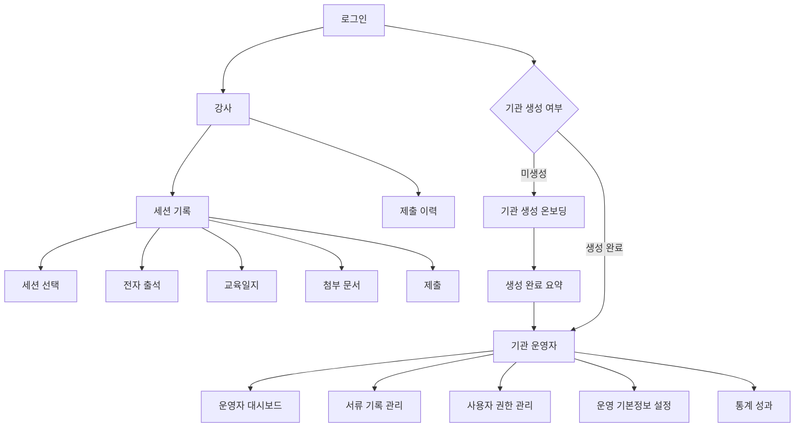
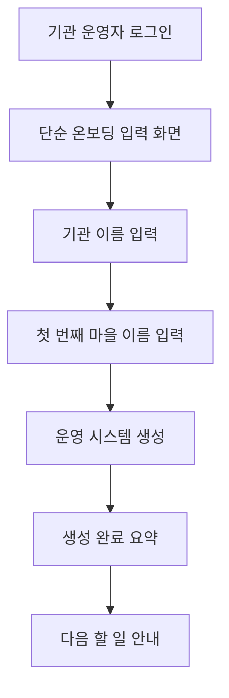
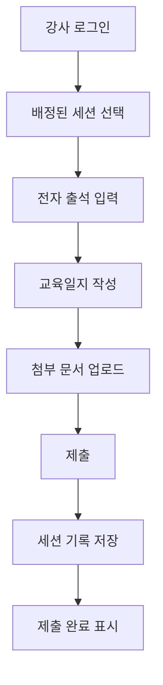
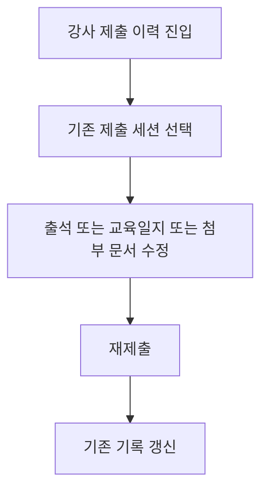
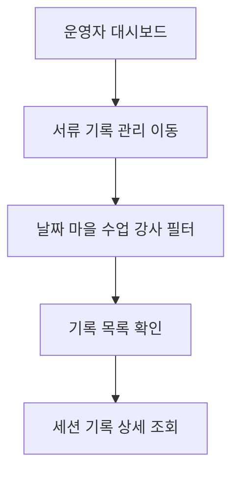
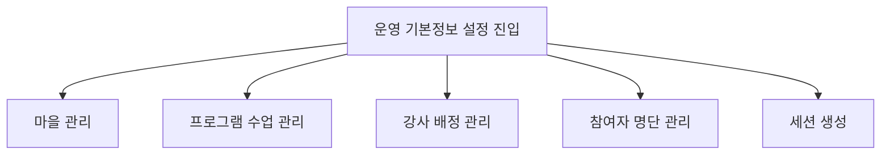

# Product Requirements Document

## 문서 목적

이 문서는 `harness_framework` 레포에서 구현 기준으로 삼는 1차 MVP PRD다.

- 회의용 소개 문서보다 `무엇을 만들고`, `무엇을 만들지 않으며`, `어떤 규칙으로 구현할지`를 명확히 하는 데 목적이 있다.
- 화면 톤과 UI 규칙은 [UI_GUIDE.md](/Users/nojonghyeon/Documents/GitHub/harness_framework/docs/UI_GUIDE.md)를 따른다.
- 기술 구조와 구현 세부사항은 `ARCHITECTURE.md`, 의사결정 기록은 `ADR.md`로 분리한다.

## 1차 구현 목표

이 레포의 현재 1차 목표는 `배포 가능한 서비스 출시`가 아니라 `개발자 로컬 환경에서 실제로 작동하는 MVP`를 만드는 것이다.

즉, 새 스레드에서 구현을 시작할 때도 우선순위는 아래와 같다.

1. 로컬에서 `npm run dev`로 앱이 실행될 것
2. Supabase와 연결된 회원가입/로그인 흐름이 동작할 것
3. 기관 생성 온보딩, 기본 운영 설정, 세션 생성, 강사 기록 제출까지 로컬에서 검증 가능할 것
4. 배포, 실메일 발송, 외부 운영 인프라는 뒤로 미룰 것

1차 로컬 MVP 범위에서 제외하는 항목:

- Vercel 배포
- Resend 기반 실제 이메일 발송
- OAuth 로그인
- 고도화된 운영 통계
- 플랫폼 관리자용 별도 백오피스 완성

## 제품 한 줄 정의

이 제품은 `지역 교육 프로그램 운영 시스템을 생성하고 운영하는 웹`이다.

다도리인을 첫 도입 기관으로 삼되, 제품 구조 자체는 특정 기관 전용이 아니라 `여러 기관/지역/마을이 각자 자기 프로그램을 설정해 사용할 수 있는 범용 운영 시스템`으로 설계한다.

즉, 1차 MVP의 목표는 두 가지를 동시에 만족하는 것이다.

1. 다도리인의 실제 운영 흐름을 빠르게 디지털화한다.
2. 이후 다른 기관도 인증 후 자기 기관 이름과 첫 번째 마을 이름을 입력해 운영 시스템을 생성하고, 그 안에서 `프로그램`, `수업`, `강사`, `참여자 명단` 등을 설정할 수 있게 만든다.

## 제품 전략

### 전략 요약

- UX와 기본 워크플로우는 다도리인의 실제 운영 흐름을 기준으로 잡는다.
- 데이터 모델과 권한 모델은 처음부터 범용화한다.
- 1차 MVP에서는 `기관별 운영 시스템을 생성한 뒤 사용하는 운영 관리 웹`을 만든다.
- 첫 진입 경험은 인증 후 단순한 온보딩 입력에서 시작한다.
- 브랜딩, 복잡한 폼 커스터마이징, 고급 통계는 뒤 단계로 미룬다.

### 왜 이렇게 가는가

- 지금 만들려는 핵심 흐름은 특정 기관에만 묶인 특수 업무가 아니라 `세션 단위 교육 운영 기록 관리`라는 범용 문제다.
- 마을 이름, 수업 이름, 출석 대상, 강사 배정 방식만 바뀌어도 다른 기관에서 같은 문제를 풀 수 있다.
- 지금부터 범용 구조로 설계하면 이후 확장 비용이 낮고, 반대로 특정 기관 전용으로 먼저 굳히면 재설계 비용이 커진다.

## 문제 정의

현재 운영 흐름에서 가장 큰 문제는 아래와 같다.

- 강사 입력과 운영자 관리가 분리되어 있다.
- 출석, 교육일지, 첨부 문서가 서로 다른 채널이나 파일로 흩어진다.
- 운영자는 특정 수업 기록을 찾고 확인하는 데 시간이 많이 든다.
- 어떤 세션이 제출되었고 어떤 세션이 비어 있는지 빠르게 파악하기 어렵다.
- 기관마다 비슷한 운영 문제를 겪지만, 이를 바로 쓸 수 있는 가벼운 운영 웹이 부족하다.

이번 MVP는 학생/부모 기능을 제외하고, `기관 운영자-강사 사이의 운영 기록 흐름`을 먼저 단순하고 안정적으로 만드는 데 집중한다.

## 제품 범위

### Must Have

1. 기관별 로그인 이후 역할 기반 화면 진입
2. 인증 후 기관 생성 온보딩
3. 생성 완료 요약 및 다음 할 일 안내
4. 강사용 세션 기록 제출 화면
5. 전자 출석 입력
6. 교육일지 작성 및 제출
7. 첨부 문서 업로드
8. 강사 제출 이력 조회
9. 기관 운영자 대시보드
10. 기관 운영자 사용자/권한 관리
11. 기관 운영자 서류/기록 조회 및 상세 확인
12. 기관별 운영 기본정보 설정
13. 기관별 데이터 분리

### Should Have

1. 운영 통계/성과 화면
2. 강사별/수업별/마을별 집계
3. 완료율/누락 현황 요약
4. 기관별 문서 유형 또는 일지 항목 일부 설정

### Could Have

1. 강사 특이사항 기록
2. 보호자 공유용 활동 요약
3. 학부모용 공지/알림
4. 학부모 대표 권한 기능
5. 일정/준비물/투표 등 커뮤니케이션 기능
6. 기관별 브랜딩 또는 도메인 커스터마이징

### Won't Have Yet

1. 학생용 앱 또는 학생 전용 기록 기능
2. 학부모용 모바일 앱 본체
3. 운영자 승인/반려 워크플로우
4. 고도화된 AI 분석/추천
5. 복잡한 게임화 및 소셜 기능
6. 기관별 완전 자유 폼 빌더

## 핵심 사용자

| 역할 | 목적 | 1차 MVP 핵심 행동 |
|---|---|---|
| 강사 | 자신에게 배정된 수업 세션 기록을 제출한다 | 세션 선택, 출석 입력, 교육일지 작성, 첨부 문서 업로드, 제출 후 재수정 |
| 기관 운영자 | 자기 기관의 운영 시스템을 생성하고 운영 기록을 관리한다 | 기관 생성 온보딩, 제출 현황 확인, 사용자/권한 관리, 운영 기본정보 설정, 기록 검색/필터링, 상세 조회 |
| 플랫폼 관리자 | 기관 단위 운영을 지원한다 | 기관 생성, 기관 활성화/비활성화, 초기 설정 지원 |

1차 MVP에서 실제 주 사용자 경험은 `강사`와 `기관 운영자`에 맞춘다. `플랫폼 관리자`는 내부 운영 관점의 역할이며, 별도 복잡한 백오피스가 꼭 필요하지는 않다.

## 핵심 도메인 정의

### 1. 기관

기관은 이 시스템을 사용하는 운영 주체다.

예시:
- 다도리인
- 다른 지역 교육 운영 조직
- 특정 마을 교육 사업 운영팀

모든 데이터는 특정 기관 소속이어야 한다.

1차 MVP에서는 기관 운영자가 인증 후 `기관 이름`과 `첫 번째 마을 이름`을 입력하면 기관 운영 시스템의 초기 뼈대가 생성된다.

이때 최초 생성자는 해당 기관의 최고 운영자 권한을 가진다.
회원가입을 마친 기관 운영자는 바로 이 온보딩 흐름으로 진입할 수 있어야 한다.

### 2. 마을

기관이 관리하는 지역 단위다. 한 기관은 여러 마을을 가질 수 있다.

1차 MVP에서 입력하는 `첫 번째 마을 이름`은 기관 운영자가 직접 정하는 최초 생성 마을이다.
기관 이름과 첫 번째 마을 이름은 생성 이후에도 수정할 수 있어야 한다.
이 수정 가능 정책은 프로그램, 수업, 세션 등 하위 데이터가 생성된 이후에도 유지된다.

### 3. 프로그램

기관이 운영하는 교육 프로그램 또는 사업 단위다. 한 프로그램 아래 여러 수업이 있을 수 있다.

### 4. 수업

실제 반복 운영되는 수업 단위다. 수업은 특정 프로그램과 마을에 연결될 수 있다.

### 5. 수업 세션

본 시스템의 기록 기준 단위는 `한 날짜의 한 수업 세션`이다.

1차 MVP에서는 수업 세션을 `기관 운영자가 미리 생성`한다.

세션은 최소 아래 식별 정보를 가진다.

- 기관
- 날짜
- 마을
- 프로그램
- 수업
- 담당 강사

출석, 교육일지, 첨부 문서는 모두 같은 세션 아래에 연결된다.

### 6. 참여자 명단

세션 출석 대상이 되는 사람들의 목록이다. 기관별, 수업별, 또는 세션별로 연결될 수 있다.

1차 MVP에서는 세션 생성 시점에 해당 세션의 출석 대상 명단을 복사해 고정한다. 이후 원본 명단이 바뀌더라도 이미 생성된 세션의 출석 대상은 자동으로 바뀌지 않는다.

### 7. 세션 기록

강사가 실제로 입력하고 제출하는 데이터 묶음을 `세션 기록`이라고 정의한다.

세션 기록은 아래 요소로 구성된다.

- 세션 식별 정보
- 출석 기록
- 교육일지
- 첨부 문서 목록
- 제출 시각
- 최종 수정 시각

## 일반화 원칙

이 제품이 다른 기관에도 적용되려면, 최소 아래 요소는 기관별로 분리되거나 설정 가능해야 한다.

1. 기관 이름
2. 마을 목록
3. 프로그램 목록
4. 수업 목록
5. 강사 계정과 담당 범위
6. 참여자 명단
7. 세션 스케줄 또는 세션 생성 기준
8. 첨부 문서 허용 규칙

1차 MVP에서는 `기관별 자유로운 모든 커스터마이징`까지 지원하지 않는다. 대신 운영상 꼭 필요한 기본 마스터 데이터만 기관 운영자가 관리할 수 있게 한다.

기관 생성 직후에는 프로그램, 수업, 강사, 참여자 명단이 비어 있는 상태를 허용한다. 이후 기관 운영자가 운영 기본정보 설정에서 하나씩 추가하는 흐름을 기본으로 한다.

## 제출 상태와 기록 정책

1차 MVP에서는 `임시저장`을 두지 않는다.

- 강사는 세션 기록을 작성하고 `최종 제출`한다.
- 제출 이후에도 강사는 같은 세션 기록을 다시 열어 수정할 수 있다.
- 수정 이력은 별도로 누적 저장하지 않고 `마지막 내용만 유지`한다.
- `submitted_at`은 최초 제출 시각으로 고정한다.
- 제출 후 수정이 일어나면 `updated_at`만 갱신한다.
- 시스템은 "제출 여부"는 관리하지만, 버전 히스토리 시스템은 아니다.

## 권한 정책

### 강사

- 자신에게 배정된 수업 세션만 조회할 수 있다.
- 자신에게 배정된 수업 세션만 작성/제출/수정할 수 있다.
- 같은 기관 내 다른 강사의 세션 기록도 볼 수 없다.
- 다른 기관 데이터에는 접근할 수 없다.

### 기관 운영자

- 자기 기관의 모든 수업 세션 기록을 조회할 수 있다.
- 자기 기관의 강사/운영자 계정을 조회하고 권한을 관리할 수 있다.
- 자기 기관의 마을, 프로그램, 수업, 명단 등 운영 기본정보를 관리할 수 있다.
- 자기 기관의 강사를 이메일 초대 링크 방식으로 직접 초대할 수 있다.
- 제출물 승인/반려 없이 `조회·관리`만 수행한다.
- 다른 기관 데이터에는 접근할 수 없다.

### 플랫폼 관리자

- 기관 생성과 초기 세팅을 지원할 수 있다.
- 여러 기관을 관리할 수 있다.
- 이 역할은 내부 운영 용도이며, 1차 MVP에서 별도 복잡한 UI까지는 필수가 아니다.

### 사용자 소속 정책

1차 MVP에서는 `한 사용자는 한 기관에만 소속`된다.

- 같은 사용자가 여러 기관에 동시에 속하는 구조는 다루지 않는다.
- 한 기관 안에서는 역할에 따라 강사 또는 운영자 권한을 가질 수 있다.
- 이미 다른 기관에 소속된 이메일은 새 기관 초대 시 실패 처리하고 안내 메시지를 제공한다.

## 정보 구조

### IA 설계 원칙

1. 1차 MVP의 주 사용자 경험은 `강사`와 `기관 운영자` 기준으로 설계한다.
2. 첫 진입 경험은 인증 후 `간단한 입력 -> 생성 -> 다음 할 일 안내` 흐름으로 설계한다.
3. 강사 경험의 중심은 `한 세션 기록을 한 흐름에서 끝내는 화면`이다.
4. 기관 운영자 경험의 중심은 `생성 완료 -> 운영 기본정보 설정 -> 대시보드 -> 기록 관리 -> 사용자/권한`이다.
5. 통계 기능은 확장 영역으로 분리한다.
6. 기관 간 데이터는 UI와 데이터 모두에서 분리되어야 한다.

### 전체 IA

## 화면 목록

| 화면 ID | 화면명 | 역할 | 우선순위 |
|---|---|---|---|
| HM-01 | 로그인 | 공통 | Must |
| HM-02 | 기관 생성 온보딩 | 기관 운영자 | Must |
| HM-03 | 생성 완료 요약 | 기관 운영자 | Must |
| TE-01 | 세션 기록 | 강사 | Must |
| TE-02 | 제출 이력 | 강사 | Must |
| OA-01 | 기관 운영자 대시보드 | 기관 운영자 | Must |
| OA-02 | 사용자/권한 관리 | 기관 운영자 | Must |
| OA-03 | 서류/기록 관리 | 기관 운영자 | Must |
| OA-04 | 운영 기본정보 설정 | 기관 운영자 | Must |
| OA-05 | 통계/성과 | 기관 운영자 | Should |

## 핵심 플로우

### F1. 기관 생성 온보딩

### F2. 강사 세션 기록 제출

### F3. 강사 제출 후 수정

### F4. 기관 운영자 기록 관리

### F5. 기관 운영자 운영 기본정보 설정

## 기능 요구사항

### HM-01 로그인

**목적**

사용자가 자신의 기관과 역할에 맞는 영역으로 진입할 수 있어야 한다.

**요구사항**

1. 로그인 이후 사용자 역할에 따라 기본 홈으로 이동해야 한다.
2. 강사는 강사 영역으로 이동해야 한다.
3. 기관 운영자는 자기 계정이 아직 어떤 기관에도 연결되지 않은 경우 기관 생성 온보딩으로 이동해야 한다.
4. 이미 기관에 연결된 기관 운영자는 기관 운영자 영역으로 이동해야 한다.
5. 권한이 없는 메뉴는 노출하지 않거나 접근을 차단해야 한다.
6. 사용자는 자기 기관 데이터에만 접근할 수 있어야 한다.

### HM-02 기관 생성 온보딩

**목적**

기관 운영자가 최소 입력만으로 자기 기관의 운영 시스템을 생성할 수 있어야 한다.

**핵심 UI**

1. 화면 중앙의 단순 입력 중심 레이아웃
2. 기관 이름 입력
3. 첫 번째 마을 이름 입력
4. 생성 액션
5. 생성 중 로딩 상태

**요구사항**

1. 이 화면은 인증 후 기관 운영자에게 제공되어야 한다.
2. 1차 MVP에서 필수 입력값은 `기관 이름`과 `첫 번째 마을 이름`이다.
3. 입력 완료 후 기관 운영 시스템의 초기 뼈대를 생성해야 한다.
4. 생성 단계에서는 프로그램, 수업, 강사, 참여자 명단까지 한 번에 받지 않는다.
5. 최초 생성자는 생성 직후 해당 기관의 최고 운영자 권한을 가져야 한다.

### HM-03 생성 완료 요약

**목적**

생성된 기관 운영 시스템의 상태를 요약하고, 다음 설정 단계로 안내해야 한다.

**핵심 UI**

1. 생성 완료 메시지
2. 생성된 기관 이름 표시
3. 생성된 첫 번째 마을 이름 표시
4. 다음 할 일 안내
5. 운영 기본정보 설정으로 이동하는 액션

**요구사항**

1. 생성 직후 사용자는 이 화면을 먼저 보아야 한다.
2. 이 화면은 생성된 최소 구조를 요약해서 보여줘야 한다.
3. 다음 단계로 `프로그램`, `수업`, `강사`, `참여자 명단` 설정이 필요함을 안내해야 한다.
4. 사용자는 이 화면에서 운영 기본정보 설정으로 이동할 수 있어야 한다.
5. 기본 프로그램은 자동 생성하지 않으며, 사용자가 이후 직접 첫 프로그램을 만들 수 있어야 한다.
6. 이 화면의 가장 중요한 다음 액션은 `첫 프로그램 만들기`여야 한다.

### TE-01 세션 기록

**목적**

강사가 한 세션의 운영 기록을 한 화면 흐름에서 끝낼 수 있어야 한다.

**핵심 UI**

1. 배정된 세션 선택
2. 전자 출석 입력 영역
3. 교육일지 입력 영역
4. 첨부 문서 업로드 영역
5. 제출 버튼
6. 제출 상태 표시

**요구사항**

1. 강사는 자신에게 배정된 세션만 볼 수 있어야 한다.
2. 제출 필수값은 `세션 정보`, `출석`, `교육일지`다.
3. 첨부 문서는 선택 입력이다.
4. 제출 시 출석, 교육일지, 첨부 문서는 같은 세션 기록 단위로 저장되어야 한다.
5. 제출 이후에도 강사는 같은 세션 기록을 다시 열어 수정할 수 있어야 한다.
6. 재제출 시 기존 기록은 갱신되고 마지막 내용만 유지한다.

**예외/정책**

1. 필수값이 누락되면 제출할 수 없다.
2. 첨부 문서 업로드 실패는 명확히 안내해야 한다.
3. 첨부 문서가 없어도 제출은 가능해야 한다.
4. 입력 중 이탈 시 손실 가능성을 사용자에게 안내할지 여부는 구현 시 UX 세부사항으로 정한다.

### TE-02 제출 이력

**목적**

강사가 자신이 제출한 세션 기록을 다시 확인하고 수정할 수 있어야 한다.

**요구사항**

1. 제출 이력은 자신이 담당한 세션 기록만 보여야 한다.
2. 목록에서는 최소 날짜, 수업, 마을, 제출 시각을 보여줘야 한다.
3. 항목 선택 시 세션 기록 상세 또는 수정 화면으로 이동할 수 있어야 한다.
4. 최초 제출 시각과 최근 수정 시각을 구분해 보여줄 수 있어야 한다.

### OA-01 기관 운영자 대시보드

**목적**

기관 운영자가 현재 운영 상태를 빠르게 파악하고 기록 관리 화면으로 이동할 수 있어야 한다.

**핵심 UI**

1. 오늘 제출 현황
2. 미제출/완료 요약
3. 최근 제출 기록
4. 최근 수정 기록
5. 빠른 이동 액션

**요구사항**

1. 오늘 기준 제출 완료 건수와 미제출 건수를 우선 노출해야 한다.
2. 최근 제출 기록은 `최초 제출된 세션 기록` 기준으로 최신순 정렬되어야 한다.
3. 최근 수정 기록은 제출 이후 변경된 세션 기록을 최신순으로 보여줘야 한다.
4. 최근 수정 기록에는 강사 수정과 기관 운영자 수정을 모두 포함해야 한다.
5. 대시보드는 기록 관리 상세 화면으로 들어가기 전 요약 화면 역할에 집중해야 한다.
6. 기관 운영자는 자기 기관 기준 데이터만 보아야 한다.

### OA-02 사용자/권한 관리

**목적**

기관 운영자가 자기 기관의 강사와 운영자 계정의 역할과 접근 범위를 관리할 수 있어야 한다.

**요구사항**

1. 기관 운영자는 자기 기관 사용자 목록을 조회할 수 있어야 한다.
2. 기관 운영자는 역할을 부여하거나 회수할 수 있어야 한다.
3. 강사 계정은 담당 수업 또는 담당 세션 범위 기준으로 배정될 수 있어야 한다.
4. 권한 변경은 즉시 반영되어야 한다.

**예외/정책**

1. 자기 자신의 최고 권한을 실수로 제거하지 않도록 방어가 필요하다.
2. 기관 운영자는 다른 기관의 사용자에 접근할 수 없어야 한다.

### OA-03 서류/기록 관리

**목적**

기관 운영자가 제출된 세션 기록을 검색하고 상세 조회할 수 있어야 한다.

**핵심 UI**

1. 기록 목록
2. 날짜 필터
3. 마을 필터
4. 수업 필터
5. 강사 필터
6. 상세 보기

**요구사항**

1. 출석, 교육일지, 첨부 문서는 같은 세션 기록 아래에서 연결 조회되어야 한다.
2. 목록에서는 세션 메타데이터와 제출 여부를 먼저 확인할 수 있어야 한다.
3. 기관 운영자는 특정 강사, 특정 수업, 특정 기간 기록을 빠르게 찾을 수 있어야 한다.
4. 기관 운영자는 상세 화면에서 출석, 교육일지, 첨부 문서를 한 흐름으로 확인할 수 있어야 한다.

**예외/정책**

1. 첨부 문서가 없는 기록은 오류가 아니라 정상적인 빈 상태로 처리한다.
2. 기관 운영자는 조회·관리만 수행하며 승인/반려 상태를 추가로 만들지 않는다.

### OA-04 운영 기본정보 설정

**목적**

기관 운영자가 자기 기관의 운영 마스터 데이터를 직접 설정하고 유지할 수 있어야 한다.

**핵심 UI**

1. 마을 목록 관리
2. 프로그램 목록 관리
3. 수업 목록 관리
4. 강사 배정 관리
5. 참여자 명단 관리
6. 세션 생성

**요구사항**

1. 기관 운영자는 자기 기관의 마을을 생성/수정할 수 있어야 한다.
2. 기관 운영자는 자기 기관의 프로그램과 수업을 생성/수정할 수 있어야 한다.
3. 기관 운영자는 강사를 특정 수업 또는 세션에 배정할 수 있어야 한다.
4. 기관 운영자는 강사를 직접 초대하고 관리할 수 있어야 한다.
5. 기관 운영자는 출석 대상이 되는 참여자 명단을 등록하고 관리할 수 있어야 한다.
6. 기관 운영자는 세션을 미리 생성할 수 있어야 한다.
7. 세션 생성 시 해당 세션의 출석 대상 명단은 복사되어 고정되어야 한다.
8. 설정 데이터는 자기 기관 범위 안에서만 유효해야 한다.
9. 프로그램이 하나도 없는 경우 `첫 프로그램 만들기`가 우선 액션으로 노출되어야 한다.

### OA-05 통계/성과

**목적**

기관 운영자가 운영 현황을 누적 관점에서 확인할 수 있도록 한다.

**요구사항**

1. 통계는 최소 `강사`, `수업`, `마을`, `기간` 축으로 조회할 수 있어야 한다.
2. 최소 지표는 `제출 건수`, `출석 입력 건수`, `교육일지 제출 건수`, `첨부 문서 업로드 건수`, `완료율`, `누락 현황`이다.
3. 본 화면은 1차 MVP의 필수 화면이 아니라 확장 영역이다.

## 데이터 및 상태 규칙

### 세션 기록의 최소 필드

구현 시 아래 개념은 분명히 존재해야 한다.

- organization_id
- village_id
- program_id
- class_id
- session_id
- teacher_id
- date
- participant roster reference
- participant roster snapshot
- attendance data
- lesson_journal data
- attachments
- submitted_at
- updated_at

### 기관 범위에서 필요한 기본 데이터

기관 단위로 최소 아래 데이터가 관리 가능해야 한다.

- 기관 정보
- 마을 목록
- 프로그램 목록
- 수업 목록
- 강사 계정
- 강사 배정 정보
- 참여자 명단

### 상태 규칙

1. 1차 MVP에서는 `draft` 상태를 두지 않는다.
2. 기록은 `제출됨`을 기준으로 운영한다.
3. 제출 이후 수정 시 새로운 버전을 쌓지 않고 기존 기록을 갱신한다.
4. `submitted_at`은 최초 제출 시각이며 재제출 시 바뀌지 않는다.
5. `updated_at`은 제출 후 수정이 발생할 때 갱신된다.
6. 운영자 승인 상태는 별도로 두지 않는다.
7. 데이터는 기관 단위로 분리되어야 한다.

## 비기능 요구사항

1. 강사 입력 흐름은 짧고 빠르게 끝나야 한다.
2. 기관 운영자 조회 화면은 필터링과 스캔 속도를 우선해야 한다.
3. UI는 [UI_GUIDE.md](/Users/nojonghyeon/Documents/GitHub/harness_framework/docs/UI_GUIDE.md)의 메신저형 운영 UI 방향을 따라야 한다.
4. 데스크톱에서도 모바일 앱처럼 익숙한 탐색 구조를 유지해야 한다.
5. 시스템이 복잡한 워크플로우 도구처럼 보이기보다, 가벼운 운영 콘솔처럼 보여야 한다.
6. 기관 간 데이터 격리는 신뢰성 측면에서 가장 중요한 요구사항 중 하나다.

## 오픈 이슈

아래 항목은 현재 미확정이며, 구현 전 또는 구현 중 추가 결정이 필요하다.

1. 로그인 방식과 인증 수단
2. 기관 생성 및 초기 온보딩을 수동으로 할지, 셀프서비스로 열지
3. 강사 배정 정보의 소스와 관리 방식
4. 운영자가 생성한 세션에 대해 반복 생성, 대량 생성 등 생성 편의 기능을 어느 수준까지 지원할지
5. 첨부 문서의 파일 형식/용량 제한
6. 입력 중 이탈 경고 UX
7. 미제출 세션을 운영자가 생성한 세션 기준으로 어떻게 계산할지
8. 통계/성과 화면을 1차에 포함할지, 1.5차로 분리할지
9. 기관별 문서 유형 또는 교육일지 폼을 어디까지 설정 가능하게 할지
10. 플랫폼 관리자용 별도 백오피스가 필요한지, 아니면 1차 MVP에서는 수동 운영으로 시작할지

## 연결 문서

- [UI_GUIDE.md](/Users/nojonghyeon/Documents/GitHub/harness_framework/docs/UI_GUIDE.md)
- [ARCHITECTURE.md](/Users/nojonghyeon/Documents/GitHub/harness_framework/docs/ARCHITECTURE.md)
- [ADR.md](/Users/nojonghyeon/Documents/GitHub/harness_framework/docs/ADR.md)
