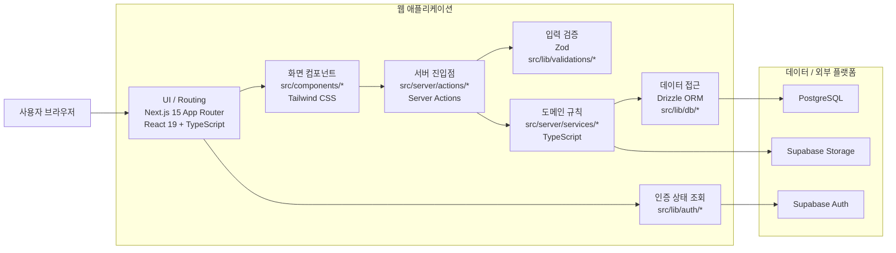
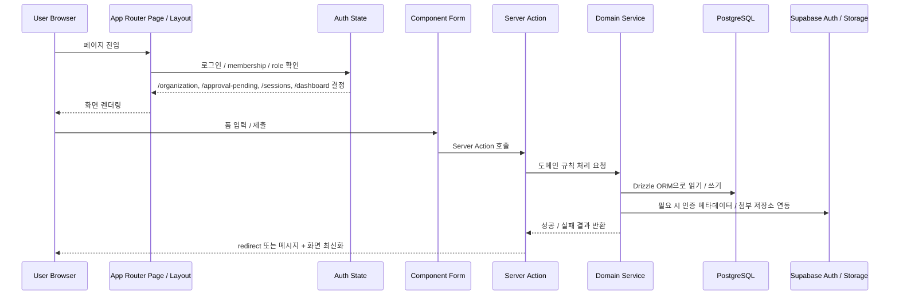
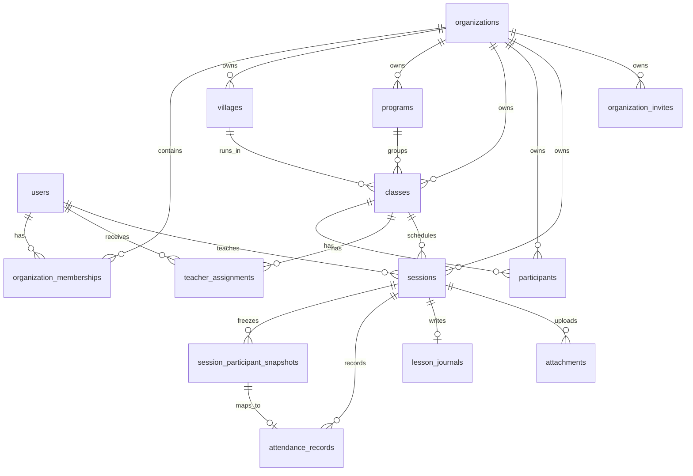

# harness_framework 시스템 이해 보고서

## 문서 목적

이 문서는 `harness_framework`를 처음 보는 사람이 이 저장소만으로도 아래 질문에 답할 수 있게 만드는 설명서다.

- 이 사업은 무엇을 해결하는가?
- 사용자는 어떤 흐름으로 이 시스템을 사용하게 되는가?
- 화면 뒤에서는 어떤 계층을 거쳐 데이터가 저장되는가?
- 어떤 테이블과 규칙이 이 시스템의 핵심인가?
- 현재 어디까지 구현되어 있고, 아직 무엇은 미구현인가?

이 문서는 기획 문서인 `docs/PRD.md`, 설계 기준인 `docs/ARCHITECTURE.md`, 기술 의사결정 문서인 `docs/ADR.md`, 그리고 실제 구현 코드 전체를 함께 읽고 정리한 현재 시점의 구현 보고서다.

## 1. 이 사업은 무엇인가

`harness_framework`는 지역 교육 사업을 운영하는 기관을 위한 운영 웹 MVP다.

조금 더 쉽게 말하면, 이 사업은 다음 일을 하나의 웹 안에서 연결한다.

1. 기관 운영자가 자기 기관용 운영 시스템을 만든다.
2. 운영자가 마을, 사업, 수업, 참여자, 강사를 등록한다.
3. 운영자가 특정 날짜의 수업 세션을 만든다.
4. 강사는 자기에게 배정된 세션만 열어서 출석, 교육일지, 첨부 문서를 제출한다.
5. 운영자는 대시보드와 기록 브라우저에서 제출 현황과 상세 기록을 확인한다.

즉 이 제품의 핵심은 `기관 운영자와 강사 사이의 세션 기록 흐름을 디지털화하는 것`이다.

## 2. 지금 구현된 범위

이 저장소는 `배포용 완성 서비스`보다 `로컬에서 실제로 작동하는 MVP`를 목표로 만들어져 있다.

현재 완료된 구현 단계는 `phases/index.json` 기준으로 아래 5개다.

1. Bootstrap foundation
2. Auth onboarding
3. Ops setup
4. Sessions submissions
5. Dashboard records

지금 실제로 되는 일은 아래와 같다.

- 이메일/비밀번호 회원가입, 로그인
- 기관 생성 온보딩
- 초대 토큰으로 기존 기관 참여
- 승인 대기 흐름
- 운영 기본정보 등록
  - 마을
  - 사업
  - 수업
  - 참여자
- 사용자 관리
  - 초대 토큰 생성
  - 역할 변경
  - 멤버 승인
  - 강사 수업 배정
- 세션 생성
- 세션 시점 참여자 스냅샷 생성
- 강사 세션 목록 조회
- 출석 입력
- 교육일지 제출 및 수정
- 첨부 문서 업로드
  - 단, 스토리지 환경변수가 있어야 실제 업로드 가능
- 운영자 대시보드
- 기록 검색/필터/상세 조회

## 2.1 한눈에 보는 시스템 그림

코드 리뷰 전에 먼저 아래 3개 그림을 보면 전체 구조를 빠르게 잡을 수 있다.

### 2.1.1 기술 스택과 런타임 계층



### 2.1.2 요청 처리 흐름



### 2.1.3 핵심 도메인 데이터 구조



### 2.1.4 이 그림을 기준으로 코드 리뷰하는 순서

1. `src/lib/auth/*`, `src/middleware.ts`, `src/app/*/layout.tsx`
   로그인 이후 사용자가 어느 화면으로 가는지와 역할 분기가 맞는지 본다.
2. `src/server/actions/*`
   폼 입력 검증, 권한 확인, redirect, `revalidatePath` 처리가 얇고 일관적인지 본다.
3. `src/server/services/*`
   실제 비즈니스 규칙이 여기 모여 있으므로 조직 범위 제한, 역할 제한, 세션 스냅샷 규칙을 집중적으로 본다.
4. `src/lib/db/schema.ts`, `drizzle/*.sql`
   테이블 관계와 제약조건이 서비스 규칙을 실제로 뒷받침하는지 본다.
5. `src/components/*`, `src/app/*/page.tsx`
   UI가 도메인 규칙을 우회하지 않고 action/service 계층을 통해서만 동작하는지 본다.

## 3. 이 사업은 전체적으로 어떻게 돌아가는가

가장 중요한 흐름만 먼저 짧게 보면 아래와 같다.

```txt
사용자 브라우저
  -> Next.js App Router 페이지 진입
  -> layout에서 인증/멤버십/역할 검사
  -> 화면 컴포넌트 렌더링
  -> 폼 제출 시 server action 실행
  -> service 계층에서 도메인 규칙 검사
  -> Drizzle ORM으로 PostgreSQL 저장
  -> 필요 시 Supabase Auth / Storage 연동
  -> revalidatePath로 화면 최신화
```

조금 더 실제 제품 흐름으로 보면 아래와 같다.

```txt
회원가입 / 로그인
  -> 사용자 동기화
  -> membership 확인
  -> 미소속이면 /organization
  -> 승인 전이면 /approval-pending
  -> teacher면 /sessions
  -> organization_admin이면 /dashboard
```

## 4. 화면 기준 사용자 흐름

### 4.1 기관 운영자 흐름

운영자는 아래 순서로 시스템을 사용한다.

```txt
로그인
  -> 기관이 없으면 /organization
  -> 기관 이름 + 첫 마을 이름 입력
  -> organization + village + membership 생성
  -> /dashboard 진입
  -> /settings에서 기본정보 입력
  -> /users에서 강사 초대/승인/배정
  -> /dashboard에서 세션 생성
  -> /records에서 제출 기록 조회
```

이 흐름을 연결하는 핵심 파일은 아래다.

- 온보딩 화면: `src/components/onboarding/onboarding-form.tsx`
- 온보딩 액션: `src/server/actions/onboarding.ts`
- 온보딩 서비스: `src/server/services/onboarding.ts`
- 설정 화면: `src/components/ops/settings-screen.tsx`
- 사용자 관리 화면: `src/components/ops/users-screen.tsx`
- 대시보드 화면: `src/components/ops/dashboard-screen.tsx`
- 기록 브라우저: `src/components/records/records-browser.tsx`

### 4.2 강사 흐름

강사는 아래 순서로 시스템을 사용한다.

```txt
운영자가 초대 토큰 생성
  -> 강사가 로그인 후 /organization에서 토큰 입력
  -> membership 생성
  -> 승인 전이면 /approval-pending
  -> 운영자가 /users에서 승인
  -> 강사는 /sessions 진입
  -> 자기에게 배정된 세션 선택
  -> 출석 입력 + 교육일지 작성 + 첨부 업로드
  -> 첫 제출 시 submitted_at 기록
  -> 이후 수정 시 updated_at만 갱신
```

이 흐름을 연결하는 핵심 파일은 아래다.

- 강사 세션 목록: `src/components/teacher/sessions-screen.tsx`
- 강사 작업공간: `src/components/teacher/session-workspace.tsx`
- 제출 액션: `src/server/actions/submissions.ts`
- 제출 서비스: `src/server/services/submissions.ts`
- 첨부 액션: `src/server/actions/attachments.ts`
- 첨부 서비스: `src/server/services/attachments.ts`

## 5. 라우팅 구조는 어떻게 나뉘는가

이 프로젝트는 `Next.js App Router` 기반이며, 라우트 그룹을 역할별로 나눈다.

### 5.1 인증 영역

- `src/app/(auth)/login/page.tsx`
- `src/app/(auth)/signup/page.tsx`
- `src/app/(auth)/layout.tsx`

여기서는 로그인/회원가입만 담당한다. 이미 로그인된 사용자는 `src/lib/auth/routing.ts` 규칙에 따라 바로 다음 화면으로 보낸다.

### 5.2 온보딩 영역

- `src/app/(onboarding)/organization/page.tsx`
- `src/app/(onboarding)/organization/complete/page.tsx`
- `src/app/(onboarding)/approval-pending/page.tsx`

기관 생성 또는 초대 참여, 그리고 승인 대기 안내를 담당한다.

### 5.3 운영자 영역

- `src/app/(ops)/layout.tsx`
- `src/app/(ops)/dashboard/page.tsx`
- `src/app/(ops)/settings/page.tsx`
- `src/app/(ops)/users/page.tsx`
- `src/app/(ops)/records/page.tsx`
- `src/app/(ops)/records/[sessionId]/page.tsx`

운영자 레이아웃은 로그인 여부와 멤버십 승인 여부를 먼저 확인하고, `teacher` 역할이면 운영자 화면이 아니라 `/sessions`로 돌려보낸다.

### 5.4 강사 영역

- `src/app/(teacher)/layout.tsx`
- `src/app/(teacher)/sessions/page.tsx`
- `src/app/(teacher)/sessions/[sessionId]/page.tsx`

강사 레이아웃은 반대로 `teacher`가 아닌 사용자를 `/dashboard`로 보낸다. 즉, 운영자와 강사는 같은 인증 시스템을 쓰지만 역할에 따라 진입 화면이 갈린다.

## 6. 내부 코드 구조는 어떻게 분리되어 있는가

이 저장소는 비교적 명확한 계층 구조를 사용한다.

### 6.1 `app`

페이지와 레이아웃이 있는 곳이다. 사용자 진입점이다.

- 페이지는 데이터를 직접 많이 처리하지 않는다.
- 인증 상태를 읽고 필요한 service 결과를 받아 화면 컴포넌트에 내려준다.

예:

- `src/app/(ops)/dashboard/page.tsx`
- `src/app/(teacher)/sessions/[sessionId]/page.tsx`

### 6.2 `components`

실제 화면을 그리는 UI 컴포넌트다.

- 폼 입력
- 카드 목록
- 상세 화면
- 액션 결과 메시지

중요한 점은, 여기서는 복잡한 DB 규칙을 직접 다루지 않고 폼 액션 호출에 집중한다는 점이다.

### 6.3 `server/actions`

폼 제출의 서버 진입점이다.

역할은 아래와 같다.

- 현재 사용자 인증 상태 확인
- 역할과 승인 여부 확인
- Zod 검증 실행
- service 호출
- `revalidatePath`로 화면 갱신
- 사용자 메시지 반환

즉 `action`은 `웹 폼과 도메인 서비스 사이의 얇은 어댑터` 역할을 한다.

### 6.4 `server/services`

실제 업무 규칙이 들어 있는 곳이다.

예를 들면 아래 규칙들이 여기에 있다.

- 기관 생성 시 organization, village, membership을 한 번에 만든다.
- teacher 역할이면서 승인된 사용자만 수업에 배정할 수 있다.
- 세션 생성 시 수업-사업-마을 조합이 맞는지 검사한다.
- 세션 생성 시 참여자 스냅샷이 반드시 생긴다.
- 강사는 자기에게 배정된 세션만 제출할 수 있다.
- 출석은 세션 스냅샷 수와 정확히 일치해야 한다.
- `submitted_at`은 최초 제출 시각만 유지한다.

즉 이 저장소에서 “사업이 실제로 어떻게 움직이는가”를 가장 잘 보여주는 곳이 `src/server/services`다.

### 6.5 `lib`

공통 기술 레이어다.

- `src/lib/auth/*`: Supabase 인증 클라이언트, 라우팅 규칙
- `src/lib/db/*`: Drizzle DB 클라이언트, 스키마
- `src/lib/env.ts`: 환경변수 검증
- `src/lib/validations/*`: Zod 스키마

### 6.6 `drizzle`

DB 마이그레이션 산출물이 있다.

- `drizzle/*.sql`
- `drizzle/meta/*`

즉 스키마 정의는 `src/lib/db/schema.ts`에 있고, 실제 DB 반영은 Drizzle 마이그레이션으로 관리된다.

## 7. 인증과 권한은 어떻게 동작하는가

이 시스템을 이해할 때 가장 중요한 축 하나가 `인증 + 멤버십 + 승인`이다.

### 7.1 인증

인증 자체는 Supabase Auth가 담당한다.

- 브라우저 로그인/회원가입: `src/components/auth/auth-form.tsx`
- 서버에서 사용자 읽기: `src/lib/auth/supabase-server.ts`
- 미들웨어 세션 갱신: `src/middleware.ts`

### 7.2 앱 사용자 동기화

서버는 로그인된 Supabase 사용자를 읽은 뒤, `users` 테이블에도 동기화한다.

핵심 함수:

- `syncAuthenticatedUser()` in `src/lib/auth/supabase-server.ts`

즉 인증 주체는 Supabase지만, 앱 내부에서 필요한 이메일/이름 정보는 자체 `users` 테이블에도 유지한다.

### 7.3 membership

이 시스템은 단순 로그인만으로는 쓸 수 없다. 반드시 `organization_memberships`가 있어야 한다.

membership이 의미하는 것은 아래와 같다.

- 어느 기관 소속인가
- 어떤 역할인가
- 승인되었는가

이 값을 기준으로 라우팅이 갈린다.

핵심 함수:

- `deriveAuthState()` in `src/lib/auth/supabase-server.ts`
- `getPostAuthDestination()` in `src/lib/auth/routing.ts`
- `getProtectedRouteRedirect()` in `src/lib/auth/routing.ts`

### 7.4 승인 단계

초대 토큰을 수락했다고 바로 시스템을 쓰는 것이 아니다.

현재 구조는 아래처럼 2단계다.

1. 초대 토큰 수락
2. 운영자의 승인

즉 초대를 받은 강사는 membership이 생겨도 `approved_at`이 비어 있으면 `/approval-pending`에 머문다.

이 설계는 로컬 MVP에서도 운영 통제를 명확하게 보여준다.

## 8. 데이터 모델은 어떻게 생겼는가

핵심 스키마는 `src/lib/db/schema.ts`에 있다.

처음 보는 사람은 아래 테이블만 이해해도 전체 구조가 거의 잡힌다.

### 8.1 사람과 소속

- `users`
- `organizations`
- `organization_memberships`
- `organization_invites`

역할은 `organization_role` enum으로 관리한다.

- `platform_admin`
- `organization_admin`
- `teacher`

### 8.2 운영 기본정보

- `villages`
- `programs`
- `classes`
- `participants`
- `teacher_assignments`

즉 운영자가 평소에 등록하는 마스터 데이터다.

### 8.3 실제 기록 단위

- `sessions`
- `session_participant_snapshots`
- `attendance_records`
- `lesson_journals`
- `attachments`

이 중 가장 중요한 것은 `sessions`와 `session_participant_snapshots`다.

## 9. 왜 세션 스냅샷이 중요한가

이 프로젝트의 핵심 설계 포인트 중 하나는 `세션 생성 시점에 참여자 명단을 복사해 고정한다`는 점이다.

흐름은 아래와 같다.

```txt
운영자가 세션 생성
  -> class에 연결된 participants 조회
  -> sessions 테이블에 세션 생성
  -> session_participant_snapshots에 복사 저장
  -> 이후 강사 출석은 이 스냅샷 기준으로 입력
```

이 구조 덕분에 생기는 장점은 아래와 같다.

- 나중에 원본 참여자 명단이 바뀌어도 과거 세션 출석부는 바뀌지 않는다.
- 운영자와 강사가 같은 기준의 출석부를 본다.
- 기록 상세 화면에서 “그날 기준 명단”을 안정적으로 복원할 수 있다.

관련 핵심 함수:

- `buildSessionParticipantSnapshots()` in `src/server/services/sessions.ts`
- `createSessionRecord()` in `src/server/services/sessions.ts`

## 10. 운영자 기능은 내부적으로 어떻게 구현되어 있는가

### 10.1 운영 기본정보 관리

운영자는 `/settings`에서 마을, 사업, 수업, 참여자를 추가한다.

동작 구조는 아래와 같다.

```txt
폼 제출
  -> src/server/actions/settings.ts
  -> organization_admin인지 검사
  -> Zod 검증
  -> src/server/services/settings.ts
  -> 해당 organization_id로 insert
  -> /settings revalidate
```

즉 설정 데이터는 모두 현재 로그인한 운영자의 `organization_id` 범위 안에서만 생성된다.

### 10.2 사용자 관리

운영자는 `/users`에서 아래 작업을 한다.

- 초대 토큰 생성
- 역할 변경
- 멤버 승인
- 강사 수업 배정

여기서 중요한 규칙은 다음과 같다.

- `teacher` 역할 사용자만 수업에 배정 가능
- 승인된 teacher만 배정 가능
- 초대 수락과 승인 단계가 분리됨

관련 파일:

- 액션: `src/server/actions/memberships.ts`
- 서비스: `src/server/services/memberships.ts`

### 10.3 대시보드

운영자 대시보드는 단순 카드 모음이 아니라, 실제 운영 우선순위를 보여주는 화면으로 구현되어 있다.

대시보드는 아래 정보를 조합한다.

- 현재 설정 공백
- 최근 제출 기록
- 제출 후 수정 기록
- 미제출 세션
- 전체 세션 대비 완료율
- 출석/일지/첨부 누적 건수

핵심 함수:

- `listSessionDashboardData()` in `src/server/services/sessions.ts`
- `listOperatorDashboardData()` in `src/server/services/dashboard.ts`

즉 대시보드는 “세션 생성 도구”와 “운영 현황 요약”을 한 화면에 묶은 구조다.

## 11. 강사 제출 기능은 내부적으로 어떻게 구현되어 있는가

강사 제출은 이 저장소에서 가장 중요한 업무 흐름 중 하나다.

### 11.1 세션 목록

강사는 `/sessions`에서 자기에게 배정된 세션만 본다.

구현 방식은 아래다.

1. 같은 기관의 세션을 조회한다.
2. 그중 `teacherId === 현재 사용자`인 세션만 남긴다.

핵심 함수:

- `listTeacherSessionCards()` in `src/server/services/sessions.ts`
- `filterTeacherAssignedSessions()` in `src/server/services/sessions.ts`

### 11.2 세션 작업공간

강사가 세션 상세로 들어가면 아래 정보가 함께 로드된다.

- 세션 메타데이터
- 스냅샷 출석 대상
- 기존 출석 값
- 기존 교육일지
- 기존 첨부 목록

핵심 함수:

- `getTeacherSubmissionWorkspace()` in `src/server/services/submissions.ts`

### 11.3 제출 저장 규칙

강사가 제출 버튼을 누르면 아래가 검사된다.

1. 자기에게 배정된 세션인가
2. 첨부 메타데이터가 유효한가
3. 출석 row 수가 스냅샷 수와 정확히 일치하는가
4. 중복 스냅샷 ID는 없는가

검사 후 아래처럼 저장된다.

```txt
attendance_records upsert
  + lesson_journals upsert
  + sessions.submitted_at / updated_at 갱신
```

중요한 규칙:

- 첫 제출이면 `submitted_at = now`
- 이후 수정이면 기존 `submitted_at` 유지
- 항상 `updated_at`은 최신값으로 갱신

핵심 함수:

- `saveTeacherSessionSubmission()` in `src/server/services/submissions.ts`

## 12. 첨부 업로드는 어떻게 처리되는가

첨부는 Supabase Storage를 사용하지만, 현재 MVP에서는 환경변수 설정 여부를 먼저 확인하는 구조다.

흐름은 아래와 같다.

```txt
파일 업로드 요청
  -> teacher가 해당 세션에 접근 가능한지 확인
  -> SUPABASE_ATTACHMENTS_BUCKET 존재 여부 확인
  -> 없으면 차단 메시지 반환
  -> 있으면 storage 업로드
  -> attachments 테이블에 메타데이터 저장
```

즉 이 기능은 “조건부 활성화”다. 스토리지 설정이 없더라도 사업 전체가 깨지지 않고, 이유를 사용자에게 알려주는 방식으로 설계되어 있다.

관련 파일:

- `src/server/actions/attachments.ts`
- `src/server/services/attachments.ts`
- `src/lib/env.ts`

## 13. 운영 기록 조회는 어떻게 구현되어 있는가

운영자는 `/records`에서 세션 기록을 찾고, `/records/[sessionId]`에서 상세를 본다.

### 13.1 기록 브라우저

브라우저는 아래 필터를 지원한다.

- 검색어
- 상태
  - 전체
  - 제출 완료
  - 제출 후 수정
  - 미제출
- 사업
- 강사

필터는 서비스 레이어에서 배열 후처리 방식으로 적용된다.

핵심 함수:

- `applyRecordFilters()` in `src/server/services/records.ts`
- `listOperatorRecords()` in `src/server/services/records.ts`

### 13.2 기록 상세

상세 화면은 아래를 같이 보여준다.

- 세션 메타데이터
- 출석 상태
- 교육일지 본문
- 첨부 목록
- 제출 시각
- 최근 수정 시각

핵심 함수:

- `getOperatorRecordDetail()` in `src/server/services/records.ts`

즉 운영자는 강사 화면을 직접 보지 않아도, 제출 결과를 읽기 전용으로 한 화면에서 검토할 수 있다.

## 14. 이 시스템에서 가장 중요한 안전장치

처음 보는 사람이 반드시 이해해야 할 구현 규칙은 아래 4가지다.

### 14.1 모든 기관 데이터는 `organization_id`로 분리된다

이 프로젝트는 기관별 DB를 따로 두지 않고 하나의 DB 안에서 `organization_id`로 분리한다.

그래서 거의 모든 서비스와 쿼리에서 아래 패턴이 반복된다.

```txt
현재 사용자 organization_id 확인
  -> where organization_id = 현재 기관
```

이 규칙이 깨지면 가장 위험한 버그가 된다.

### 14.2 로그인만으로는 접근할 수 없다

반드시 membership이 있어야 하고, 초대 기반 사용자는 승인까지 끝나야 한다.

즉 접근 조건은 아래 3단계다.

1. 인증
2. 기관 소속
3. 승인

### 14.3 강사는 자기 세션만 다룬다

강사는 자기에게 배정된 세션만 볼 수 있고 제출할 수 있다.

운영자 영역과 강사 영역이 레이아웃에서 분리되어 있고, 서비스에서도 다시 검증한다.

즉 UI와 서비스 양쪽에서 방어한다.

### 14.4 제출 시점과 수정 시점을 분리한다

이 시스템은 “제출했는가?”와 “그 뒤에 수정되었는가?”를 구분한다.

그래서 운영자 대시보드에서 아래 두 가지를 나눠 볼 수 있다.

- 최근 제출
- 최근 수정

이 구분은 실제 운영에서 꽤 중요하다. 새로 들어온 기록과 나중에 바뀐 기록은 처리 의미가 다르기 때문이다.

## 15. 환경변수와 실행 조건

로컬 MVP가 실제로 돌아가려면 환경변수가 필요하다.

필수 키는 `src/lib/env.ts`에서 검증한다.

- `NEXT_PUBLIC_SUPABASE_URL`
- `NEXT_PUBLIC_SUPABASE_ANON_KEY` 또는 `NEXT_PUBLIC_SUPABASE_PUBLISHABLE_KEY`
- `SUPABASE_SERVICE_ROLE_KEY`
- `DATABASE_URL`

선택 키:

- `RESEND_API_KEY`
- `EMAIL_FROM`
- `SUPABASE_ATTACHMENTS_BUCKET`

즉 인증과 DB는 필수고, 메일과 첨부 업로드는 선택적 확장 요소다.

## 16. 현재 기준으로 아직 미구현이거나 제한적인 것

처음 보는 사람이 이 저장소를 완성형 제품으로 오해하지 않도록, 아직 없는 것도 같이 알아야 한다.

현재 문서와 구현을 기준으로 아래 항목은 아직 범위 밖이거나 제한적이다.

- 실제 배포 운영
- OAuth 로그인
- 실제 초대 메일 발송
- 플랫폼 관리자용 본격 백오피스
- 고도화된 통계/분석
- 승인/반려 워크플로우 고도화
- 학생/학부모용 별도 앱
- 자유도 높은 폼 빌더

또한 사용자 관리와 일부 필터링은 MVP답게 단순 구현이다. 예를 들어 기록 필터는 현재 메모리 후처리 방식이며, 더 큰 데이터셋이 되면 DB 레벨 검색 최적화가 필요해질 수 있다.

## 17. 이 저장소를 이해할 때 가장 먼저 보면 좋은 파일 순서

처음 입문하는 사람에게는 아래 순서가 가장 이해가 빠르다.

1. `docs/PRD.md`
2. `docs/ARCHITECTURE.md`
3. `docs/ADR.md`
4. `src/lib/db/schema.ts`
5. `src/lib/auth/supabase-server.ts`
6. `src/server/services/onboarding.ts`
7. `src/server/services/settings.ts`
8. `src/server/services/memberships.ts`
9. `src/server/services/sessions.ts`
10. `src/server/services/submissions.ts`
11. `src/server/services/dashboard.ts`
12. `src/server/services/records.ts`

이 순서대로 보면 “기획 의도 -> 스키마 -> 인증 상태 -> 주요 도메인 흐름” 순서로 머릿속에 들어온다.

## 18. 한 문장으로 다시 요약

`harness_framework`는 `기관 운영자가 세션을 만들고, 강사가 그 세션의 출석·일지·첨부를 제출하며, 운영자가 이를 대시보드와 기록 브라우저에서 관리하는 local-first 멀티기관 운영 웹 MVP`다.

그리고 이 저장소는 그 흐름을 `App Router 페이지 -> server actions -> service 규칙 -> Drizzle/Postgres -> Supabase Auth/Storage` 구조로 비교적 명확하게 구현하고 있다.
