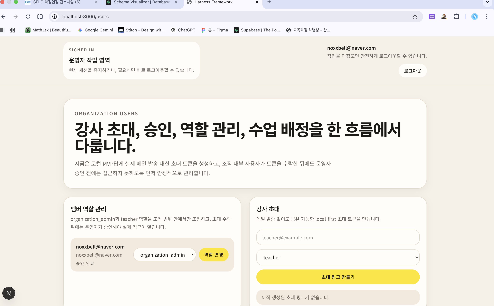
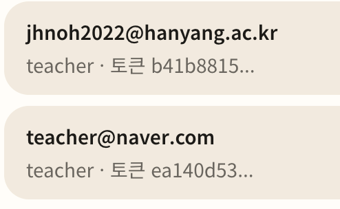

1. 프로그램 말고 사업으로 이름 바꾸기
2. 
이 창에서도 뒤로가기 만들기

3. 현재 강사 초대를 진행해야 세션이 만들어지잖아. 이러면 사실상 처음에 강사가 초대되기까지 기달려야 하는데 사용자 경험 측면에서 별로 안좋은 거 같아. 차라리 강사에 대해서 나중에 할당해도 되게 만드는 걸로 변경하자
4. 그리고 현재는 명단이 처음에 딱 아이들의 수업 명단을 만들어야 하는데 이것도 운영자가 원할때 각 세션에 참여자를 추가 할 수 있으면 좋겠어. 
5. 그리고 
여기서 토큰이 짤리는 것도 이상해. 운영자가 다음에 다시 토큰을 복사할 수 있게 만들자.
6. 그리고 세션을 만들고 나서 세션 별 대시보드를 만들고 싶은데 현재는 세션 만들고 끝이야. 그 후에 할 수 있는게 없잖아. 